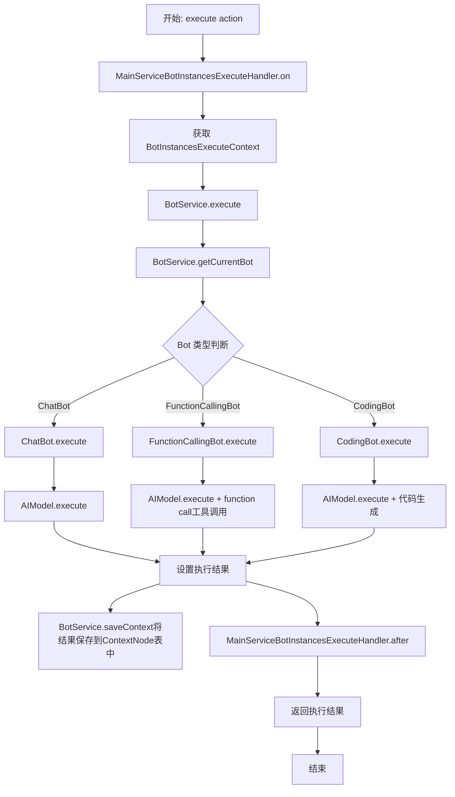
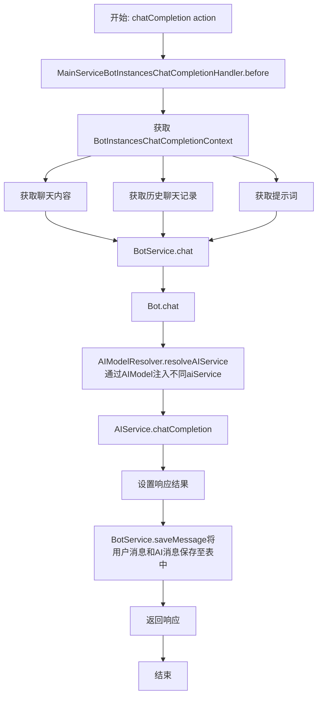
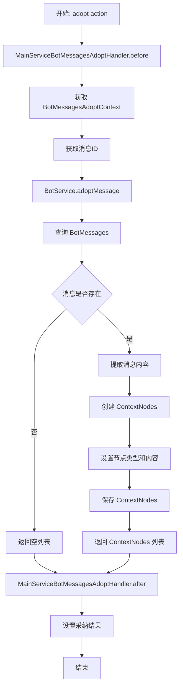
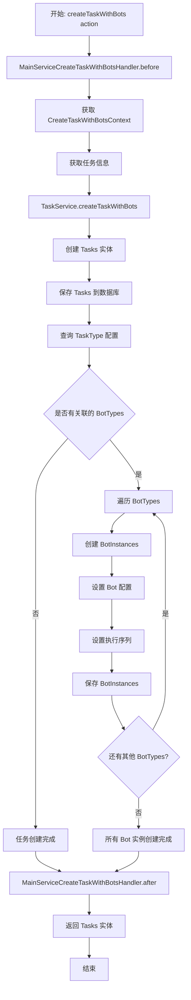
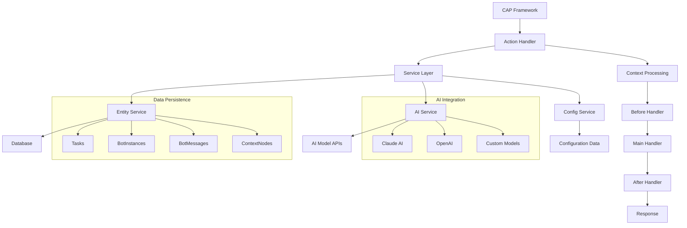
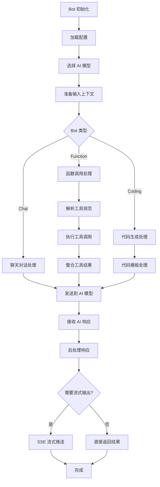

# CAP Actions 流程图

## 1. BotInstances.execute() Action 流程图

## 2. BotInstances.chatCompletion() Action 流程图

## 3. BotMessages.adopt() Action 流程图

## 4. createTaskWithBots() Action 流程图

## 5. 整体系统交互流程图

## 6. Bot 执行生命周期流程图

