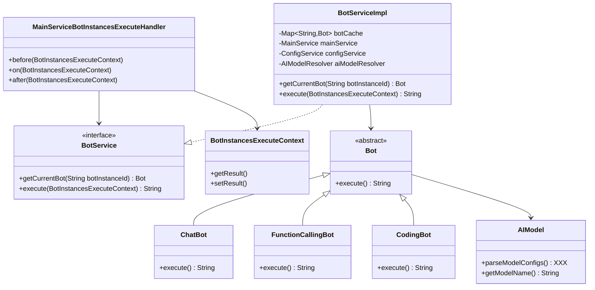
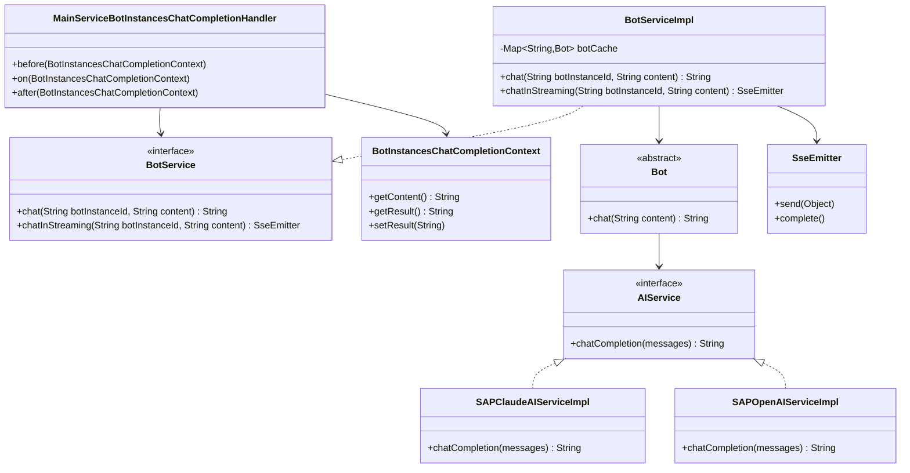
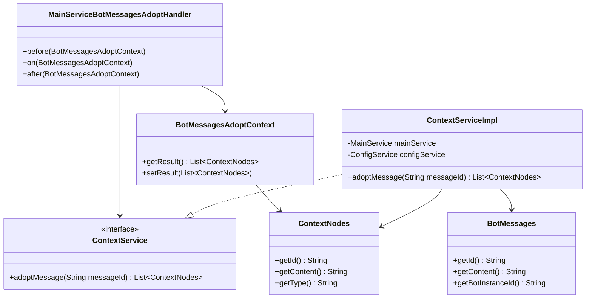
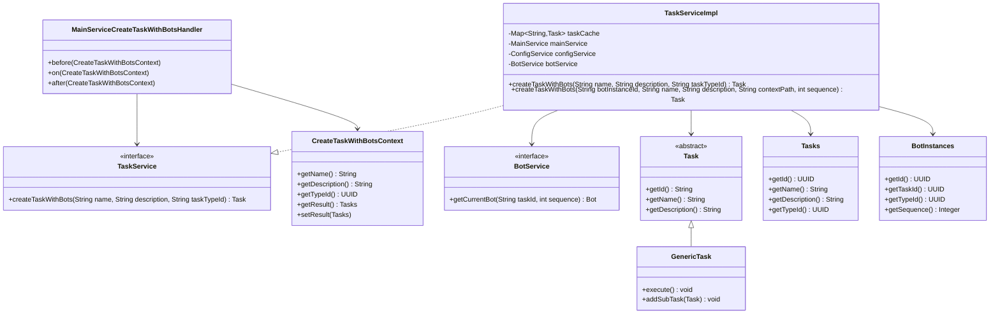

# CAP Actions 流程图

## 1. BotInstances.execute() Action

```mermaid
classDiagram
    class MainServiceBotInstancesExecuteHandler {
        +before(BotInstancesExecuteContext)
        +on(BotInstancesExecuteContext)
        +after(BotInstancesExecuteContext)
    }
    
    class BotService {
        <<interface>>
        +getCurrentBot(String botInstanceId) Bot
        +execute(BotInstancesExecuteContext) String
    }
    
    class BotServiceImpl {
        +getCurrentBot(String botInstanceId) Bot
        +execute(BotInstancesExecuteContext) String
        -Map~String,Bot~ botCache
        -MainService mainService
        -ConfigService configService
        -AIModelResolver aiModelResolver
    }
    
    class Bot {
        <<abstract>>
        +execute() String
    }
    
    class ChatBot {
        +execute() String
    }
    
    class FunctionCallingBot {
        +execute() String
    }
    
    class CodingBot {
        +execute() String
    }
    
    class AIModel {
        +parseModelConfigs() XXX
        +getModelName() String
    }
    
    class BotInstancesExecuteContext {
        +getResult()
        +setResult()
    }
    
    MainServiceBotInstancesExecuteHandler --> BotService
    BotServiceImpl ..|> BotService
    BotServiceImpl --> Bot
    Bot <|-- ChatBot
    Bot <|-- FunctionCallingBot
    Bot <|-- CodingBot
    Bot --> AIModel
    MainServiceBotInstancesExecuteHandler --> BotInstancesExecuteContext
```

## 2. BotInstances.chatCompletion() Action

```mermaid
classDiagram
    class MainServiceBotInstancesChatCompletionHandler {
        +before(BotInstancesChatCompletionContext)
        +on(BotInstancesChatCompletionContext) 
        +after(BotInstancesChatCompletionContext)
    }
    
    class BotService {
        <<interface>>
        +chat(String botInstanceId, String content) String
        +chatInStreaming(String botInstanceId, String content) SseEmitter
    }
    
    class BotServiceImpl {
        +chat(String botInstanceId, String content) String
        +chatInStreaming(String botInstanceId, String content) SseEmitter
        -Map~String,Bot~ botCache
    }
    
    class Bot {
        <<abstract>>
        +chat(String content) String
    }
    
    class AIService {
        <<interface>>
        +chatCompletion(messages) String
    }
    
    class SAPClaudeAIServiceImpl {
        +chatCompletion(messages) String
    }
    
    class SAPOpenAIServiceImpl {
        +chatCompletion(messages) String
    }
    
    class BotInstancesChatCompletionContext {
        +getContent() String
        +getResult() String
        +setResult(String)
    }
    
    class SseEmitter {
        +send(Object)
        +complete()
    }
    
    MainServiceBotInstancesChatCompletionHandler --> BotService
    BotServiceImpl ..|> BotService
    BotServiceImpl --> Bot
    Bot --> AIService
    AIService <|.. SAPClaudeAIServiceImpl
    AIService <|.. SAPOpenAIServiceImpl
    BotServiceImpl --> SseEmitter
    MainServiceBotInstancesChatCompletionHandler --> BotInstancesChatCompletionContext
```

## 3. BotMessages.adopt() Action

```mermaid
classDiagram
    class MainServiceBotMessagesAdoptHandler {
        +before(BotMessagesAdoptContext)
        +on(BotMessagesAdoptContext)
        +after(BotMessagesAdoptContext)
    }
    
    class ContextService {
        <<interface>>
        +adoptMessage(String messageId) List~ContextNodes~
    }
    
    class ContextServiceImpl {
        +adoptMessage(String messageId) List~ContextNodes~
        -MainService mainService
        -ConfigService configService
    }
    
    class BotMessagesAdoptContext {
        +getResult() List~ContextNodes~
        +setResult(List~ContextNodes~)
    }
    
    class ContextNodes {
        +getId() String
        +getContent() String
        +getType() String
    }
    
    class BotMessages {
        +getId() String
        +getContent() String
        +getBotInstanceId() String
    }
    
    MainServiceBotMessagesAdoptHandler --> ContextService
    ContextServiceImpl ..|> ContextService
    MainServiceBotMessagesAdoptHandler --> BotMessagesAdoptContext
    BotMessagesAdoptContext --> ContextNodes
    ContextServiceImpl --> BotMessages
    ContextServiceImpl --> ContextNodes
```

## 4. createTaskWithBots() Action

```mermaid
classDiagram
    class MainServiceCreateTaskWithBotsHandler {
        +before(CreateTaskWithBotsContext)
        +on(CreateTaskWithBotsContext)
        +after(CreateTaskWithBotsContext)
    }
    
    class TaskService {
        <<interface>>
        +createTaskWithBots(String name, String description, String taskTypeId) Task
    }
    
    class TaskServiceImpl {
        +createTaskWithBots(String name, String description, String taskTypeId) Task
        +createTaskWithBots(String botInstanceId, String name, String description, String contextPath, int sequence) Task
        -Map~String,Task~ taskCache
        -MainService mainService
        -ConfigService configService
        -BotService botService
    }
    
    class BotService {
        <<interface>>
        +getCurrentBot(String taskId, int sequence) Bot
    }
    
    class Task {
        <<abstract>>
        +getId() String
        +getName() String
        +getDescription() String
    }
    
    class GenericTask {
        +execute() void
        +addSubTask(Task) void
    }
    
    class Tasks {
        +getId() UUID
        +getName() String
        +getDescription() String
        +getTypeId() UUID
    }
    
    class BotInstances {
        +getId() UUID
        +getTaskId() UUID
        +getTypeId() UUID
        +getSequence() Integer
    }
    
    class CreateTaskWithBotsContext {
        +getName() String
        +getDescription() String
        +getTypeId() UUID
        +getResult() Tasks
        +setResult(Tasks)
    }
    
    MainServiceCreateTaskWithBotsHandler --> TaskService
    TaskServiceImpl ..|> TaskService
    TaskServiceImpl --> BotService
    TaskServiceImpl --> Task
    Task <|-- GenericTask
    TaskServiceImpl --> Tasks
    TaskServiceImpl --> BotInstances
    MainServiceCreateTaskWithBotsHandler --> CreateTaskWithBotsContext
```